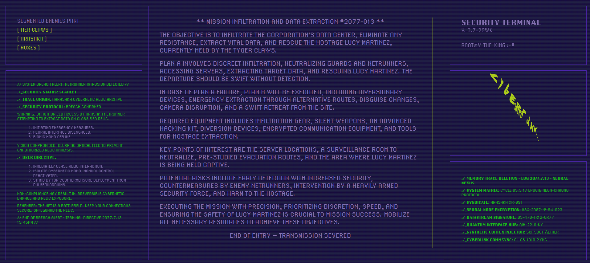

# Projet Cyberpunk Animation

- **Frame** : Section affichant le titre de la mission et des liens vers des ennemis potentiels.
- **Content** : Section principale affichant les détails de la mission, y compris les objectifs, les risques et les équipements nécessaires.
- **Meta** : Plusieurs sections affichant des informations supplémentaires sur la mission, telles que les alertes de sécurité, les données techniques, etc.
- **Image tournante : Une animation visuelle ajoutant au thème cyberpunk de la page.

## Fonctionnalités

- Conception réactive : Le site est conçu pour s'adapter à différents appareils et résolutions d'écran.
- Animation : Utilisation d'animations CSS pour rendre l'expérience plus immersive.
- Thème cyberpunk : Utilisation de couleurs, de polices et de styles visuels inspirés du genre cyberpunk.

## Captures d'écran

Screenshot : 

Démonstration video : 

## Dépendances

- HTML5
- CSS3
- JavaScript (pour l'interactivité future)
